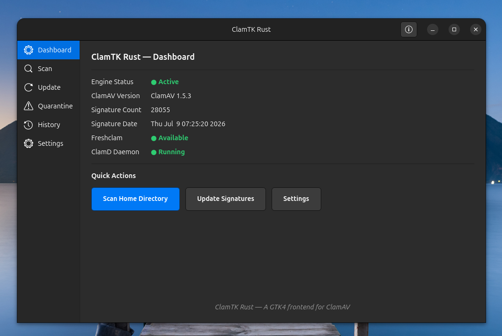

## **Build & Run Instructions**  
  
# Prerequisites  
 - Rust toolchain (rustup.rs)  
 - GTK4 development libraries  
 - ClamAV installed (clamscan, freshclam)  
   
# Install GTK4 dev libraries (Ubuntu/Debian)  
sudo apt install libgtk-4-dev libadwaita-1-dev  
   
# Install GTK4 dev libraries (Fedora)  
sudo dnf install gtk4-devel libadwaita-devel  
   
# Install ClamAV  
sudo apt install clamav clamav-daemon # Debian/Ubuntu  
sudo dnf install clamav clamd # Fedora  
   
# Build  
cd clamtk-rs  
cargo build --release  
   
# Run  
cargo run --release  
   
# Or install system-wide  
sudo cargo install --path .  
  
# Build a snap (classic confinement)  
sudo snap install snapcraft  
cd clamtk-rs  
snapcraft pack  
  
# Install the built snap  
sudo snap install --dangerous ./clamtk-rs_1.0.0_amd64.snap  
 
